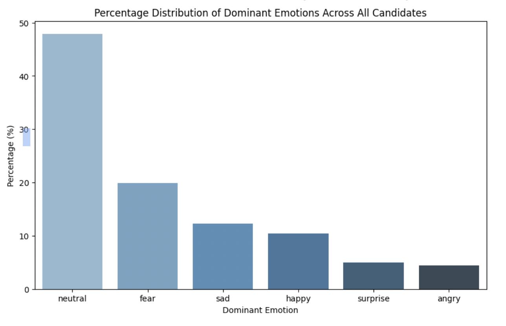
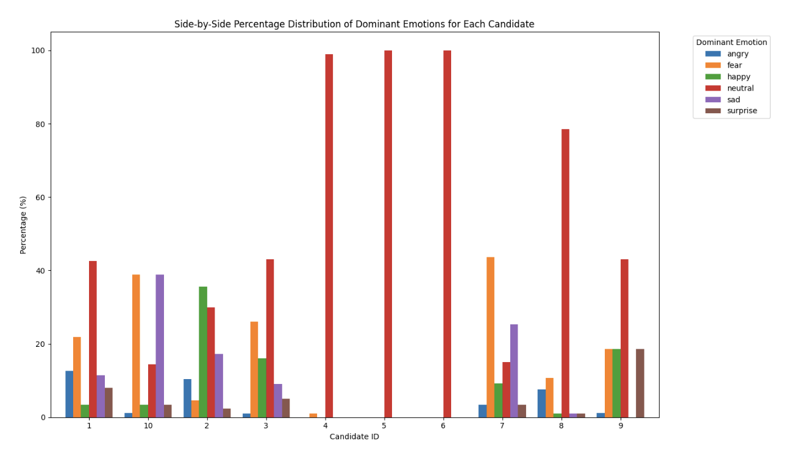
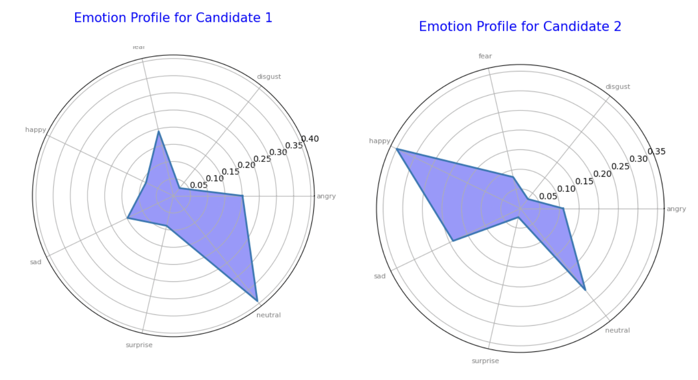
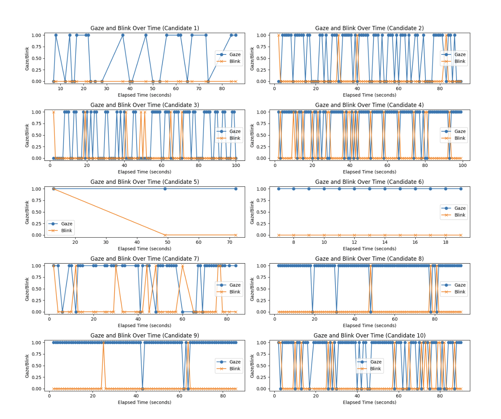
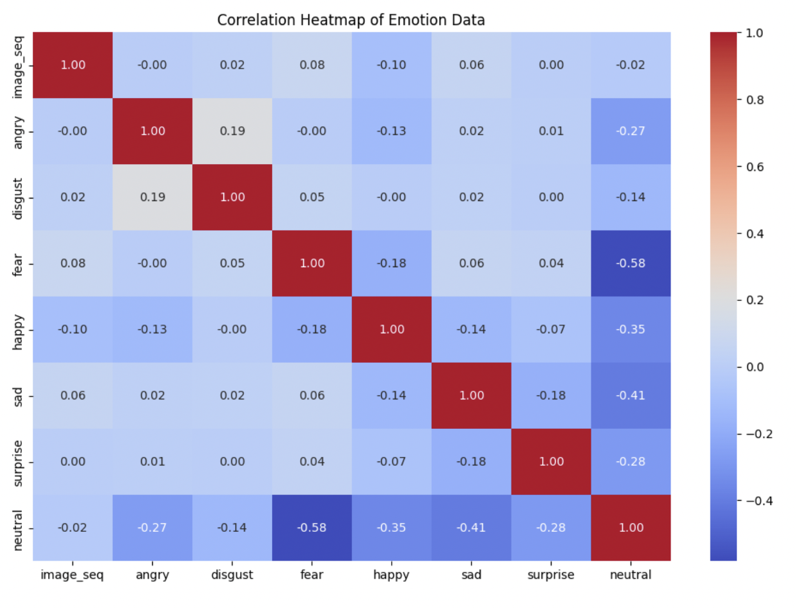
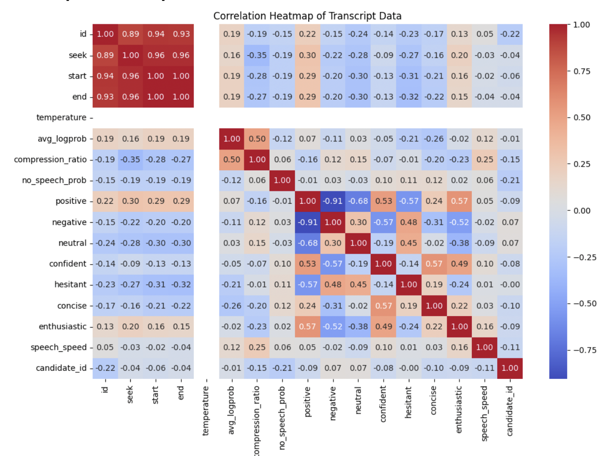

# Decoding Emotions: EDA for Better Hiring

## Introduction

**This project evaluates the communication and emotional qualities of candidates through Exploratory Data Analysis (EDA)**. Using data from interview videos, we aim to extract actionable insights into emotional stability, communication effectiveness, and adaptability. The analysis helps identify key traits that are critical for recruitment decisions.

## Key Analyses and Findings

### Distribution of Emotions

- **Overall Distribution**: Neutral emotions dominate, covering nearly 50% of the spectrum, followed by fear, sadness, and happiness. Neutrality suggests **emotional control** and **calmness**, suitable for **high-pressure roles**(e.g. HFT roles,Data Analysis Roles etc..).


- **Individual Distribution**: Candidates with varied emotions (e.g., fear, sadness, surprise) indicate **adaptability** and **creativity** but may require further evaluation for **leadership roles.**(e.g. Business Analyst roles)



### Emotional Profiles of Candidates



- Candidates exhibiting a high percentage of neutral emotions demonstrate emotional stability, crucial for **leadership or management roles**.
- Positive emotions like happiness suggest enthusiasm and a positive outlook, ideal for collaborative roles such as **sales or public relations**.

### Gaze and Blink Analysis



- **Gaze Stability**: Indicates focus and attentiveness. Candidates with steady gazes are better suited for detail-oriented roles.
- **Blink Frequency**: Excessive blinking may indicate stress, while too little suggests unnatural behavior. A moderate rate reflects calmness and engagement.

### Heatmaps and Correlation Matrices



- **Emotion Relationships**:
  - Positive correlations: Anger and disgust show a slight positive relationship.
  - Negative correlations: Neutral emotions negatively correlate with fear and anger, highlighting the ability to handle stress.


- **Emotion and Communication Overlap**:
  - Confidence positively correlates with conciseness (0.72) and enthusiasm (0.62), indicating strong communication skills.

### Visualizations

Key visualizations include:
- Bar charts illustrating dominant emotion distributions.
- Spider plots highlighting individual emotional strengths and weaknesses.
- Heatmaps showing relationships between emotions and communication traits.

## How to Run

1. Clone the repository.
2. Install the required dependencies using `pip install -r requirements.txt`.
3. Open the Jupyter Notebook in the `notebooks/` folder and follow the steps.
4. Use the provided sample dataset or load your own.

## Conclusion

This analysis provides a data-driven approach to recruitment by decoding emotional and communication traits. The insights gained help align candidates with roles that suit their strengths, ensuring better hiring decisions.

---

### Repository Structure
```plaintext
Emotion-Led-Candidate-Analysis/
├── README.md               # Overview and instructions
├── notebooks/
│   └── EDA.ipynb  # Jupyter Notebook
├── docs/
│   ├── EDA_Report.md       # Report in markdown
│   └── EDA_Report.pdf      # Original report in PDF
├── data/
│   └── sample_data.csv      # Placeholder for dataset
├── images/
│   └── visualizations.png  # Saved visualizations
└── requirements.txt        # Dependencies
```

## Contact

For questions or contributions, feel free to reach out!
